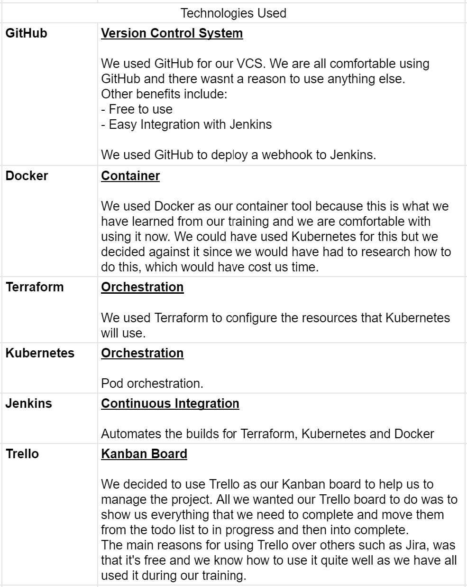

# Introduction 
In this group project we were asked to see what we can produce and how well we can apply the knowledge we have gained over the last 10 weeks within the given time constraints.
One of the purposes of this project was for us to experience working to complete a deliverable as part of a team, as this experience will be invaluable for us in the future with interviews with clients. 

# Scope
We were working with these externally developed applications:
- https://github.com/spring-petclinic/spring-petclinic-angular
- https://github.com/spring-petclinic/spring-petclinic-rest
- They were documented applications for the ‘Spring Pet Clinic’ domain, one of which serves as a front end client using AngularJS and the other as an API using Java.
In short, we were expected to deploy this application.

# User Stories 
Below is a screenhot of the user stories.

# Technologies Used

# Risk Assessment
The following screenshot shows the Risk Assessment carried out. Below that is the screenshot of the Risk Assessment matrix.

# Jenkins Build Stages
Below is how the pipeline appears on Jenkins:

# Deployment Pipeline 

# Deployed App

# Price Estimate 
